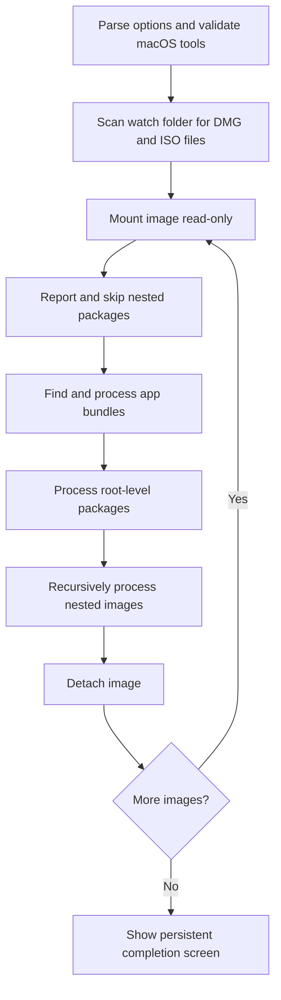

# DMG Watch Installer

A macOS `.command` script that scans a watch folder for disk images, mounts them read-only, and installs eligible applications through a fixed-screen terminal interface.

It supports:

- `.dmg` and `.iso` images
- Drag-and-drop `.app` bundles
- Root-level `.pkg` and `.mpkg` installers
- DMG/ISO files nested inside other mounted images
- Existing applications stored in `/Applications`, `$HOME/Applications`, or application folders on external volumes
- A dry-run mode that shows the complete installation plan without changing the Mac
- A dependency-free TUI that stays open when processing finishes

> [!CAUTION]
> Package installers execute with administrator privileges and can run arbitrary installer scripts. Use this tool only with disk images and packages you trust. The script reports package signature results in its log, but it does **not** require software to be signed.

## Contents

- [Compatibility](#compatibility)
- [Installation](#installation)
- [Quick start](#quick-start)
- [Command-line usage](#command-line-usage)
- [Installation rules](#installation-rules)
- [How destination matching works](#how-destination-matching-works)
- [Technical design](#technical-design)
- [Security model](#security-model)
- [Logs and exit codes](#logs-and-exit-codes)
- [Limitations](#limitations)
- [Troubleshooting](#troubleshooting)
- [Repository layout](#repository-layout)

## Compatibility

DMG Watch Installer is macOS-only and is designed for:

- macOS 10.15 Catalina or later
- Intel and Apple silicon Macs
- Apple’s built-in `/bin/bash` 3.2 or a newer Bash release
- Terminal.app and other terminals that support standard ANSI cursor controls

No Homebrew packages, Python modules, or third-party command-line tools are required. The script uses standard macOS utilities such as `hdiutil`, `mdfind`, `ditto`, `pkgutil`, and `installer`.

The script is host-neutral: it contains no embedded user name, computer name, fixed home directory, temporary-folder token, or volume name. User-specific paths are derived at runtime from `$HOME` or supplied explicitly.

Historical PowerPC-era releases, recoveryOS, and non-macOS systems are outside the compatibility target.

## Installation

### Clone the repository

```bash
git clone <repository-url>
cd dmg-watch-installer
chmod +x DMG_Watch_Installer.command
```

Git normally preserves the executable bit. The `chmod` command is safe to repeat.

### Install from a ZIP release

Extract the release archive, then run:

```bash
cd /path/to/dmg-watch-installer
chmod +x DMG_Watch_Installer.command
```

The supplied release ZIP stores the script with executable permissions. Some browsers or archive utilities may remove that permission, which is why the explicit `chmod` step is documented.

### Raw-file download

A raw `.command` download will commonly need:

```bash
chmod +x /path/to/DMG_Watch_Installer.command
```

## Quick start

The default watch folder is:

```text
$HOME/Downloads/DMG Watch
```

When the default folder does not exist, the first run creates it and exits. Add disk images to that folder, then run the script again.

### 1. Review the proposed actions

```bash
./DMG_Watch_Installer.command --dry-run
```

Dry-run mode mounts and inspects disk images, resolves existing application locations, examines package payloads, and displays what would happen. It does not copy applications or invoke the macOS package installer.

### 2. Perform the installation

```bash
./DMG_Watch_Installer.command
```

Close applications that are about to be replaced before starting a live run.

### 3. Use a different watch folder

```bash
./DMG_Watch_Installer.command --dry-run "/path/to/watch folder"
./DMG_Watch_Installer.command "/path/to/watch folder"
```

Paths containing spaces are supported when quoted.

## Command-line usage

```text
DMG_Watch_Installer.command [options] [watch-folder]
```

| Option | Behavior |
|---|---|
| `--dry-run` | Mount and inspect images without copying apps or installing packages. |
| `--plain` | Disable the full-screen TUI and print one event per line. |
| `--no-tui` | Alias for `--plain`. |
| `--tui` | Request the full-screen interface when an interactive terminal is available. |
| `--no-color` | Disable ANSI colors. |
| `--no-wait` | Exit immediately after the final TUI render instead of waiting for a key. |
| `--version` | Print the script version. |
| `-h`, `--help` | Show built-in help. |
| `--` | End option parsing; useful when a watch-folder name begins with `-`. |

Only one positional watch-folder path may be supplied.

### Completion screen

In interactive TUI mode, the final summary remains visible until one of these keys is pressed:

- `Enter`
- `q` or `Q`
- `x` or `X`
- `Esc`

Use `--no-wait` for shell automation or unattended jobs.

### Environment variables

| Variable | Purpose | Default |
|---|---|---|
| `DMG_WATCH_FOLDER` | Watch folder used when no positional path is supplied. | `$HOME/Downloads/DMG Watch` |
| `DMG_DEFAULT_APP_DIRECTORY` | Destination for a new app when no installed copy is found. Must be an absolute directory other than `/`. | `/Applications` |
| `DMG_MAX_IMAGE_DEPTH` | Maximum nested DMG/ISO depth, from `0` through `64`. | `8` |
| `DMG_LOG_FILE` | Absolute path naming the log file, not a directory. | `$HOME/Library/Logs/DMG Watch Installer.log` |
| `NO_COLOR` | Disables color when set to any value. | Unset |

Examples:

```bash
DMG_WATCH_FOLDER="$HOME/Downloads/Installers" \
  ./DMG_Watch_Installer.command --dry-run
```

```bash
DMG_DEFAULT_APP_DIRECTORY="$HOME/Applications" \
  ./DMG_Watch_Installer.command
```

```bash
DMG_MAX_IMAGE_DEPTH=12 \
DMG_LOG_FILE="$HOME/Library/Logs/dmg-watch-custom.log" \
  ./DMG_Watch_Installer.command --plain --no-wait "/path/to/images"
```

A positional watch-folder argument takes precedence over `DMG_WATCH_FOLDER`.

## Installation rules

### Disk-image discovery

The watch folder is scanned recursively for regular files ending in `.dmg` or `.iso`, case-insensitively. The scan does not descend into `.app`, `.pkg`, or `.mpkg` bundles or common macOS metadata directories.

Each image is:

1. Mounted read-only with `hdiutil`
2. Mounted without opening Finder
3. Inspected for apps, packages, and nested images
4. Detached after processing

Source images are not deleted, moved, renamed, or modified. Running the script again processes them again.

### Application bundles

The script finds `.app` bundles throughout a mounted image, including apps stored in ordinary subfolders. Once an app bundle is found, its contents are pruned from the search so embedded helper apps are not treated as independent applications.

An application is skipped when:

- It lacks a regular, non-symbolic-link `Contents/Info.plist`
- It is a symbolic link rather than a real bundle directory
- It looks like a proprietary installer wrapper, such as `Installer.app`, `Install Something.app`, or an app that embeds package installers
- Its destination is a symbolic link, a non-directory object, or an unrelated app using the same default filename

A GUI installer application is not launched automatically because there is no universal, reliable, silent command-line interface for arbitrary installer apps.

### Package installers

Only `.pkg` and `.mpkg` items located directly at the root of a mounted image are eligible for installation.

Packages inside normal subfolders are logged and skipped. Their presence does not prevent an independent root-level package from being installed.

Package symbolic links are rejected. Legitimate flat packages are files and legitimate bundle packages are directories, so following a package symlink is unnecessary and unsafe.

Before a live package installation, the script:

1. Attempts to expand the package with `pkgutil --expand-full`
2. Searches the expanded payload for application bundles
3. Checks whether a payload app matches an existing installation on another volume
4. Chooses the matching target volume when the result is unambiguous
5. Records the package signature report in the log
6. Runs Apple’s `installer` command with administrator authorization

When no single matching external volume can be determined, the package target is `/`.

A package controls its own internal installation locations. Selecting a target volume does not let the script force a package into an arbitrary custom subfolder.

### Nested DMG and ISO files

Disk images found inside a mounted image are processed recursively, even when they are stored in a subfolder.

Example:

```text
Outer.dmg
└── Installers/
    └── Inner.iso
        └── Manual Install/
            └── Application.dmg
                └── Example.app
```

Nested images are not searched for inside `.app`, `.pkg`, or `.mpkg` bundles. The default recursion limit is eight image levels and can be changed with `DMG_MAX_IMAGE_DEPTH`.

The duplicate-image guard applies within the current run. It prevents the same canonical image path from being processed twice during that run.

## How destination matching works

The central rule is: **when an installed copy can be identified, replace it at its existing location rather than moving it to `/Applications`.**

### 1. Identify the source app

The script reads `CFBundleIdentifier` from `Contents/Info.plist` with `PlistBuddy`. It also records the source bundle filename.

### 2. Query Spotlight

When a bundle identifier exists, the script queries Spotlight for that identifier. It also runs a filename query for the `.app` bundle name.

Spotlight results are filtered to reject:

- Apps embedded inside another app
- The script’s temporary mount and staging areas
- `/System`
- Temporary directories
- Trash folders
- Time Machine and backup locations
- Downloaded or archived copies outside accepted application-folder patterns

### 3. Search non-indexed conventional folders

Spotlight indexing may be disabled on an external volume. A fallback search checks:

```text
/Applications
$HOME/Applications
/Volumes/*/Applications
/Volumes/*/Apps
```

External Spotlight results in application-like folders containing names such as `Applications` or `Apps` are also accepted.

### 4. Verify identity

When the source app has a bundle identifier, an installed candidate must have the same identifier. When no identifier is available, the script falls back to a case-insensitive filename match.

### 5. Resolve multiple matches

If several installed copies match, the script warns and ranks them using:

1. Exact application filename
2. Conventional `Applications` or `Apps` locations
3. Most recent modification time as the tie-breaker

The selected path is shown in the TUI and written to the log. Review multiple-match warnings during the dry run before proceeding.

### 6. Install transactionally

For a drag-and-drop app, the script:

1. Copies the new bundle to a hidden staging path beside the destination
2. Re-reads the staged bundle identifier when one is available
3. Moves the existing app to a temporary backup path
4. Moves the staged app into the final destination
5. Restores the backup if final placement fails
6. Removes the backup after success

Staging and backup paths are on the destination filesystem so the final moves are local to that volume.

## Technical design



### Bash compatibility

The implementation intentionally avoids Bash features introduced after Bash 3.2. Empty arrays are represented with sentinel entries where necessary because Apple’s Bash 3.2 can treat a fully emptied array as unbound when `set -u` is active.

If the file is accidentally invoked with `sh`, the opening guard re-executes it with `/bin/bash` before Bash-specific syntax is reached.

### TUI renderer

The full-screen interface:

- Uses the terminal alternate-screen buffer
- Addresses each row and column directly
- Emits no newline characters while repainting
- Leaves the terminal’s last column unused to avoid pending-wrap scrolling
- Hides the cursor while active and restores it on exit
- Temporarily restores the normal terminal before a `sudo` password prompt
- Falls back to plain output when the terminal is redirected, reports `TERM=dumb`, or is too small

The practical minimum is approximately 69 columns by 19 rows. `--tui` requests the interface but still falls back safely when the terminal cannot support it.

### Progress accounting

The progress bar is image-based rather than byte-based. The initial denominator is the number of images found in the watch folder. When a mounted image reveals another DMG or ISO, the denominator grows dynamically.

A large copy, mount, package expansion, or package installation may therefore leave the percentage unchanged temporarily while the current phase continues to update.

### Temporary data and cleanup

Temporary mount points, package expansions, Spotlight result files, and transaction state are created under a unique directory inside `${TMPDIR:-/tmp}`.

Signal and exit traps attempt to:

- Restore an interrupted application transaction
- Detach mounted disk images in reverse order
- Remove the temporary working directory
- Restore the cursor and terminal screen

`Ctrl-C` is supported and returns exit status `130` after cleanup.

### Non-interactive image mounting

`hdiutil` receives no standard input. Password-protected images, images requiring interactive license acceptance, or other images that need a prompt are expected to fail rather than displaying a hidden prompt or blocking indefinitely.

## Security model

The script reduces risk in several ways:

- Disk images are mounted read-only.
- Finder is not opened automatically.
- Source images are never removed or modified.
- `.app` searches do not descend into app bundles.
- Nested image searches do not descend into app or package bundles.
- Malformed app directories and symbolic-link `Info.plist` files are rejected.
- Package symlinks are rejected.
- Existing app destinations that are symlinks are rejected.
- Control characters from discovered names are neutralized before terminal display and structured log messages.
- App replacement uses staging, backup, verification, and rollback steps.
- Administrator authorization is requested only when required for the destination or a package installation.
- Full operational details are preserved in a log.

These controls do not make untrusted software safe. In particular:

- A package installer runs scripts as `root`.
- An installed app can execute arbitrary code when launched.
- Package signatures are reported but not enforced.
- App signatures and notarization are not used as installation gates.
- The script does not compare version numbers; it will install an older build if that is the source provided.
- A package can choose installation behavior beyond what its visible filename suggests.

Always review a dry run and use trusted installation media.

## Logs and exit codes

The default log is:

```text
$HOME/Library/Logs/DMG Watch Installer.log
```

The log includes:

- Image paths and recursion depth
- Mount and detach results
- Spotlight queries
- Existing-app matches and selected destinations
- Planned or completed app operations
- Package target inference
- Package signature output
- Skipped nested packages
- Failures and final counters

The log is appended across runs.

### Exit codes

| Code | Meaning |
|---:|---|
| `0` | Run completed without recorded failures. A dry run also returns `0` when successful. |
| `1` | Setup failed or one or more processing operations failed. |
| `2` | Invalid option or invalid environment configuration. |
| `69` | Unsupported platform, unsupported Bash, or a required macOS tool is missing. |
| `129` | Interrupted by `SIGHUP`. |
| `130` | Interrupted by `Ctrl-C` / `SIGINT`. |
| `143` | Interrupted by `SIGTERM`. |

Skipped items do not by themselves produce a failure exit code. They are counted separately and written to the log.

## Limitations

- Proprietary GUI installer apps are skipped rather than automated.
- Encrypted images and images requiring interactive acceptance are not supported non-interactively.
- Root-level package installers may run vendor scripts that produce their own output or behavior.
- `installer -target` selects a volume, not an arbitrary folder inside that volume.
- An external installed app in an unconventional directory may not be found when Spotlight indexing is disabled. The fallback intentionally searches only conventional `Applications` and `Apps` directories.
- Multiple installed copies are resolved by a documented heuristic; the script cannot infer which copy a person considers primary.
- Apps currently running are not terminated automatically.
- Gatekeeper may still block an unsigned or unnotarized app when it is launched.
- Terminal layout can be imperfect for filenames containing wide Unicode glyphs. `--plain` remains available.
- Paths containing newline characters are not a supported edge case, even though disk-image and bundle discovery otherwise uses NUL-delimited `find` output.
- The script is an installer, not an updater. It does not download software, check vendor feeds, compare semantic versions, or remove processed images.

## Troubleshooting

### The display scrolls instead of staying fixed

Use the current release, which paints absolute terminal rows in the alternate screen buffer. For terminals with unusual ANSI handling, use:

```bash
./DMG_Watch_Installer.command --plain
```

### The TUI does not appear

The script intentionally falls back to plain output when:

- Output is redirected
- `TERM` is `dumb`
- The terminal is too narrow or short
- The session is not interactive

Increase the terminal size or run with `--tui`. A terminal that remains too small will still use plain mode.

### The final screen does not close

That is the default interactive behavior. Press `Enter`, `q`, `x`, or `Esc`. Use `--no-wait` for automatic exit.

### An app on an external disk was not detected

First inspect the log for the Spotlight query and fallback search. Confirm that:

- The external volume is mounted
- The app is inside an `Applications` or `Apps` folder, or Spotlight indexes its custom application-like folder
- The source and installed app have the same bundle identifier

Always review the destination shown by `--dry-run`.

### A package was skipped

Only packages at the root of the currently mounted image are eligible. Packages inside a separate folder are deliberately ignored and logged.

### A DMG fails immediately

The image may be damaged, encrypted, require a license prompt, or use a format that `hdiutil` cannot mount read-only without interaction. Review the detailed `hdiutil` output in the log.

### Administrator authorization is requested

A password prompt is expected when writing to a protected destination such as `/Applications` or when invoking a package installer. User-writable external application folders may not require authorization.

### A multiple-match warning appears

The warning identifies the selected destination. Review the complete candidate context in the log and remove obsolete duplicates or relocate the intended copy before running live if the selected destination is not correct.

## Repository layout

```text
dmg-watch-installer/
├── .github/
│   └── workflows/
│       └── validate.yml
├── tests/
│   └── validate.sh
├── .gitattributes
├── .gitignore
├── CHANGELOG.md
├── CONTRIBUTING.md
├── DMG_Watch_Installer.command
├── LICENSE
├── README.md
└── SECURITY.md
```

The validation workflow performs syntax, metadata, executable-permission, host-neutrality, help/version, and empty-folder smoke checks on a GitHub-hosted macOS runner. It does not install third-party applications or packages.

## Contributing

See [CONTRIBUTING.md](CONTRIBUTING.md). Changes should retain Bash 3.2 compatibility, avoid machine-specific paths, preserve dry-run behavior, and include validation updates when behavior changes.

## License

Released under the [MIT License](LICENSE).
